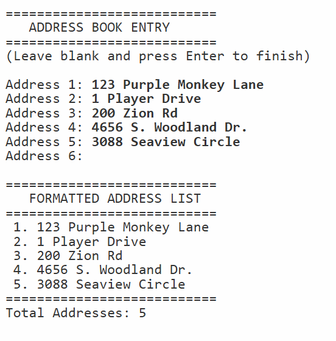

# 📋 Address Book with Title-Case Formatting

A C# (.NET Core 3.1) console application that collects a list of
addresses from the user, applies title-case formatting to each entry,
and displays the cleaned and formatted address list. Demonstrates
`List<T>`, string manipulation methods, and collection iteration.

---

## 📋 Features

- Collects multiple addresses dynamically using `List<string>`
- Formats each address with proper title-case capitalization
- Displays the formatted list with numbered entries
- Validates that entries are not blank — blank entry signals end of input
- Handles any input casing by converting to lowercase first before
  applying title case for consistent results
- Exits gracefully if no addresses are entered

---

## ⚙️ How It Works

1. The user is prompted to enter addresses one at a time
2. Each address is added to a `List<string>`
3. Entering a blank line signals the program to stop collecting
4. Each address is converted to title case using
   `TextInfo.ToTitleCase()` from `System.Globalization`
5. The formatted list is displayed with numbered entries and a total count

---

## 💡 Example Output

```
===========================
   ADDRESS BOOK ENTRY
===========================
(Leave blank and press Enter to finish)

Address 1: 123 main street
Address 2: 456 OAK AVENUE
Address 3: 789 pine road
Address 4:

===========================
   FORMATTED ADDRESS LIST
===========================
 1. 123 Main Street
 2. 456 Oak Avenue
 3. 789 Pine Road
===========================
Total Addresses: 3
```

---

## 🛠️ Technologies Used

| Technology              | Purpose                                      |
|-------------------------|----------------------------------------------|
| C# 8.0                  | Core programming language                    |
| .NET Core 3.1           | Runtime framework                            |
| `List<string>`          | Dynamic address storage                      |
| `System.Globalization`  | Locale-aware title-case formatting           |
| `TextInfo.ToTitleCase`  | Converts addresses to title case             |
| `for` loop              | Numbered iteration over formatted list       |
| `foreach` loop          | Iterating raw addresses for formatting       |

---

## 🎓 Learning Outcomes

- Using `List<T>` for dynamic data collection
- Applying `System.Globalization.TextInfo.ToTitleCase()` for
  locale-aware string formatting
- Using a blank entry as a sentinel value to stop input collection
- Iterating collections with `foreach` and `for` loops
- Separating concerns by extracting `CollectAddresses`,
  `FormatAddresses`, and `PrintAddressList` into named methods
- Handling edge cases like no input being entered

---

## 📁 Folder Structure

```
A13-lists/
├── Program.cs
├── A13.csproj
├── a13-screenshot-output.png
├── .gitignore
├── LICENSE
└── README.md
```

---

## 🚀 How to Run

### Prerequisites
- [.NET Core 3.1 SDK](https://dotnet.microsoft.com/download/dotnet/3.1)

### Steps

```bash
# Clone the repository
git clone https://github.com/MissMarzelous/A13-lists.git

# Navigate into the project folder
cd A13-lists

# Run the application
dotnet run
```

---

## 📸 Screenshots

### Console Output



---

## 👩‍💻 Author

**MissMarzelous** — C# .NET Core student project
